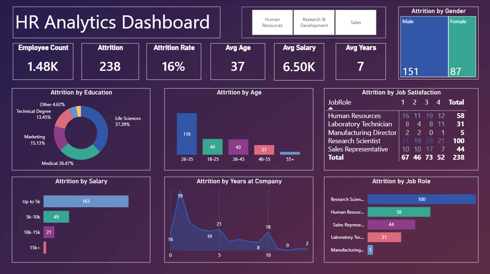

# HR Analytics Dashboard

A Power BI dashboard that tracks employee attrition across a workforce of 1,480 employees. It breaks down attrition by age, gender, salary, education, job role, job satisfaction, and years at the company — giving HR teams a clear picture of where and why employees are leaving.

